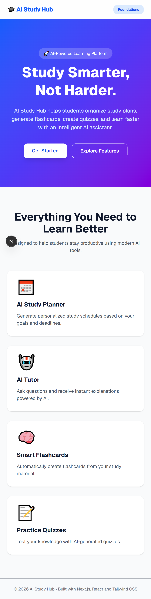
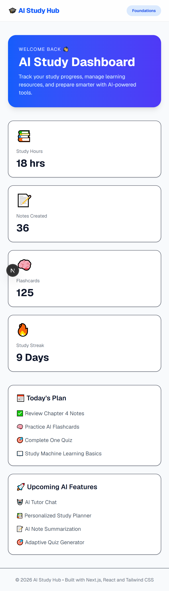
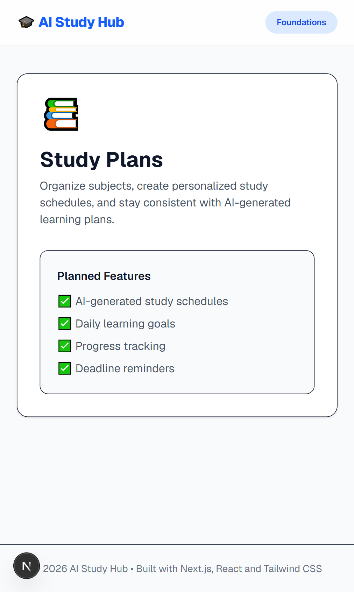
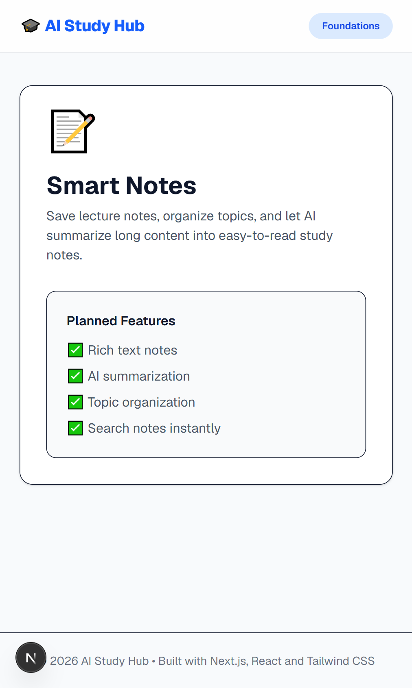
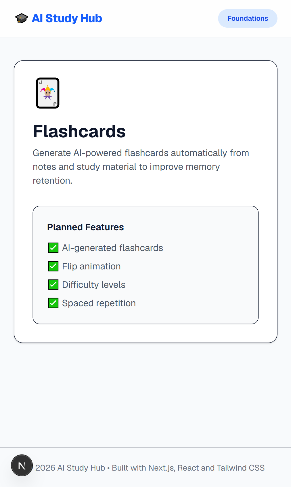
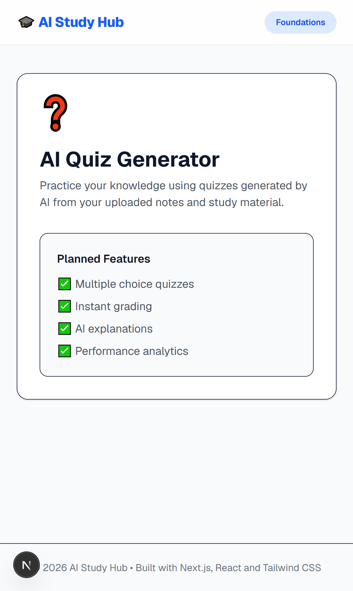
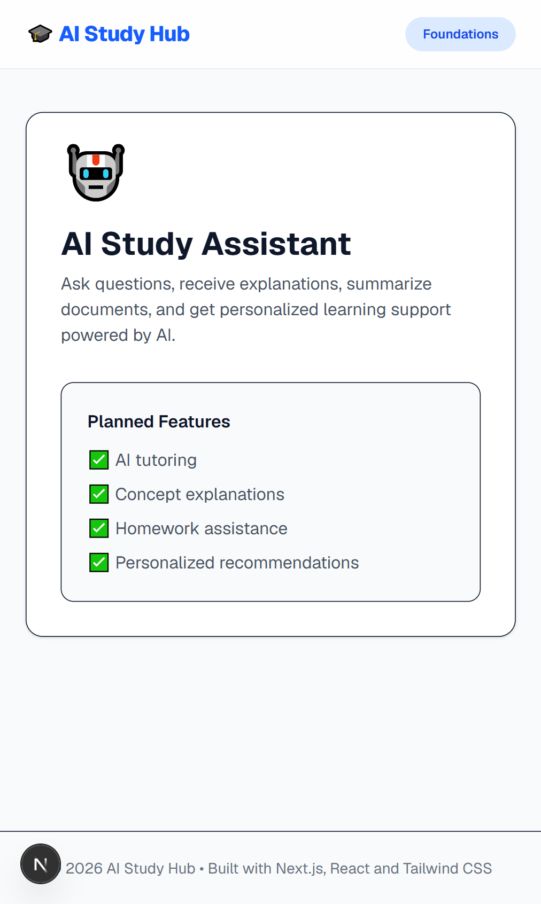
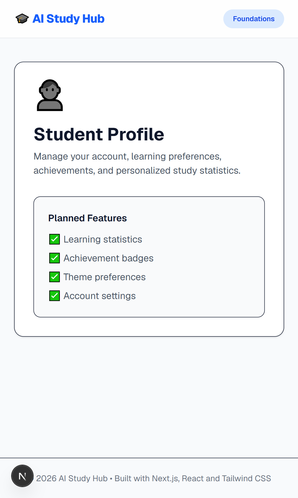
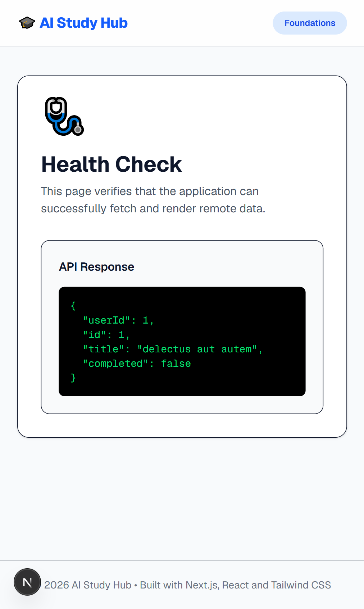

# 📚 AI Study Hub

An AI-powered study platform built with **Next.js 16**, **React 19**, **TypeScript**, and **Tailwind CSS**.

The project serves as the foundation of a modern learning platform where students can organize study materials, generate AI-powered notes, create flashcards, take quizzes, and track their learning progress.

This project was developed as part of the **Frontend AI Engineering Capstone (FE-04)**.

---

# 🚀 Live Demo

https://ai-study-hub-drab.vercel.app

---

# 📂 GitHub Repository

https://github.com/ahsenbilal19/ai-study-hub

---

# 📸 Screenshots

## 🏠 Home

<p align="center">
  
</p>

---

## 📊 Dashboard

<p align="center">
  
</p>

---

## 📅 Study Plans

<p align="center">
  
</p>

---

## 📝 Notes

<p align="center">
  
</p>

---

## 🧠 Flashcards

<p align="center">
  
</p>

---

## ❓ Quiz

<p align="center">
  
</p>

---

## 🤖 AI Assistant

<p align="center">
  
</p>

---

## 👤 Profile

<p align="center">
  
</p>

---

## ❤️ Health Check

<p align="center">
  
</p>

---

# ✨ Features

- Responsive modern UI
- Next.js App Router
- Server Components by default
- Client Components for interactivity
- AI Study Dashboard
- Study Plans page
- Notes page
- Flashcards page
- Quiz page
- AI Assistant page
- Profile page
- Health Check page
- Responsive navigation
- Clean project architecture
- Tailwind CSS styling
- TypeScript support
- Ready for future AI integrations

---

# 🛠 Tech Stack

- Next.js 16
- React 19
- TypeScript
- Tailwind CSS v4
- App Router
- Vercel

---

# 📁 Project Structure

```
app/
│
├── dashboard/
├── study/
├── notes/
├── flashcards/
├── quiz/
├── ai-assistant/
├── profile/
├── health/
│
components/
│
public/
│
screenshots/
```

---

# ⚙️ Installation

```bash
git clone https://github.com/ahsenbilal19/ai-study-hub.git

cd ai-study-hub

npm install

npm run dev
```

---

# 📱 Responsive Design

The application has been designed for:

- Mobile (375px)
- Tablet
- Desktop (1280px+)

---

# 🚀 Deployment

The application is deployed using **Vercel** with automatic deployments on every push to the `main` branch.

---

# 🎯 Learning Outcomes

- Next.js App Router
- Server Components
- Client Components
- File-based Routing
- Component Architecture
- Responsive Design
- Tailwind CSS
- TypeScript
- Modern UI Design
- Deployment with Vercel

---

# 🔮 Future Improvements

- AI Study Planner
- AI Quiz Generator
- AI Flashcard Generator
- Authentication
- Database Integration
- User Progress Tracking
- Dark Mode
- AI Note Summarization

---

# 👨‍💻 Developer

**Ahsen Bilal**

Frontend AI Engineering Intern @ FlyRank AI

Built with ❤️ using Next.js & Tailwind CSS.